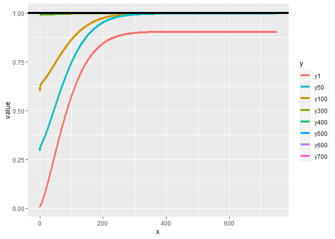

# Contribution

This paper investigates the game interaction surrounding wildfire prevention in a landscape with different owners. In a dynamic model of vegetation growth, landowners choose how much forest to cut down to prevent wildfires. Considering that wildfire ignition risk, spread and damage are dependent on the fuel stock, the authors investigate the implications of different beliefs and information sets. In this setting, landowners may operate based on misconceptions of the probabilities of wildfires or their damages. The authors investigate how these beliefs may lead to socially inefficient outcomes. 

## My comments, feelings, questions
I'm kind of disappointed by the absence of spatial process, and the consideration of just a forest stock.

I'm still kind of confused about the formulation of the fire ignition process. Indeed, whether fire ignites in $i$ or in $k$ and spreads, or in $i$ and in $k$ and spreads, the results are the same. There is no intensity element.

# Technical issues
While the paper raises an interesting question, it is flawed in several respects, when it comes to its core formulation. 

## Binary variable for fire occurrence, probability and arrival rate

First, a random variable $\theta_{it} \in \{0,1\}$ measures the occurrence of fire. The arrival of fire is said to be modeled as a Poisson distribution. However, the random variable depicted here is binary, while Poisson processes describe a number of occurrences over a finite period. It is therefore left to the reader how to make sense of this formulation. Indeed, the question remains as to how $\theta_{it}$ maps to the Poisson process. 

My interpretation is that 
\begin{align*}
\theta=1 &\iff X \sim P(\lambda) 
\\
&x>0
\end{align*}
that is to say, fire occurs if the fire arrival variable that follows a Poisson distribution has a realization which value is superior to 0. Hence :
\begin{align*}
    \mathcal{P}(X>0)&=1-P(X=0)\\
    &= 1- e^{-\lambda}
\end{align*}
Therefore:
\begin{equation}
    \mathcal{P}(\theta_{it}=1)=1-e^{-\lambda}
\end{equation}

## Concerns about the arrival rate : formulation, temporal mismatch, reliance on the forest biomass
In eq(13) of the article, the "arrival rate" is defined as : 
$$
\lambda(\gamma, f_{jt},f_{kt})=1-e^{-\gamma\frac{k(f_{jt})+k(f_{kt})}{W}}
$$
If anything, the relevant formulation here would be :
\begin{equation*}
    \lambda(\gamma, f_{jt},f_{kt})=\gamma\frac{k(f_{jt})+k(f_{kt})}{W}
\end{equation*}
Which is consistent with the interpretation of an arrival rate depending on the fuel, as it grows with the fuel. 

Moreover, there seems to be a temporal mismatch. In section 2.4, the authors write: 

*in the absence of fuel treatment of fire, forest biomass growth is given by $k(f_{it})$*

Therefore, the biomass \textbf{ in t+1} is governed by this growth function. It is striking that \textbf{in t}, the fire arrival rate and hence, the probability that the parcel ignites depends on $k(f_{it})$

On a more conceptual note, it is unclear why the ignition rate on any parcel depends on the total forest area. Ignition probabilities are mostly local, depending on environmental conditions, and not necessarily based on the amount of available fuel. Considering small neighboring parcels, it is likely that those environmental conditions are identical. 

## A surprising damage function
The formulation of the damage function is difficult to rationalize. In equation (4), the authors posit that the damage resulting from the fire is a *decreasing* function of the standing forest. There is no comment on this hypothesis. Later on, in table 1, which displays the specifications of the functional forms : 
\begin{align*}
& D_{it}=e^{-\frac{0.1}{f_{it}}}\\
& \Rightarrow \frac{\partial D_{it}}{\partial f_{it}}=-0.1\times -\frac{1}{f_{it}}
\end{align*}
Two comments are in order: 

1. The derivative of the damage function is clearly positive, hence contradicting equation (4):
\begin{equation*}
        \frac{\partial D_{it}}{\partial f_{it}}=\frac{0.1}{(f_{it})^2}e^{-\frac{0.1}{f_{it}}}>0
\end{equation*}

2. The limits are such that : 
    \begin{align*}
        \lim_{f_{it} \to 0}D(f_{it})&=0\\
        \lim_{f_{it} \to \infty}D(f_{it})&=1
    \end{align*}

## The formulation of the expected damage 
### A reformulation of the paper's formula 
Third, the formulation in equation (5) of the expected damage includes:

* *the probability of fire occurring on parcel j and the associated damage and*
* *the probability of fireoccurring on parcel k and spreading to parcel j and the associated damage*

However, the formulation of equation (5) is : 
\begin{equation*}
    D_{jt,total}=\theta_{jt}D(f_{jt})+\theta_{kt}\phi_{jt}(f_{kt})D(f_{jt})
\end{equation*}
In this equation, except for $\phi_{jt}$, there is no probability. It is merely a formulation of the damage in a potential outcome framework, without the associated probability.

A relevant expected damage function would write, in this context : 
\begin{align*}
    D_{jt,total}&=D(f_{jt})\left[ \mathcal{P}(\theta_{it}=1)+\mathcal{P}(\theta_{kt}=1 \& \text{Spread from k to j}) \right]\\
    &=D(f_{jt})\left[ \mathcal{P}(\theta_{it}=1)+\mathcal{P}(\theta_{kt}=1)\times \phi_{jt}(f_{kt}) \right]\\
\end{align*}

###  Independence and expected damage as a share
From line 1 to line 2, the independence of ignition and spread is required to obtain a formulation akin to that of the authors. However, the local probability of ignition and the probability of spread both depends on the forest stock. Therefore, *one cannot assume that the two variables are independent*. 

For the sake of the argument, assuming that both ignition and spread are independent, this would imply : 
$$
 D_{jt,total}=D(f_{jt})(1-e^{-\lambda})(1+\phi(f_{kt}))
$$
The following graph traces the expected damage for different values of the forest standing in the neighboring lot. It is clear that the formulation of the damage function as a share requires additional assumptions and that the false assumption of independence lead to results that contradict the share formulation:

<!-- -->

This result is not surprising. A decomposition of the the article's formulation of expected damage function can help explain those results : 

* The damage, depending on the forest stock in parcel $j$. The functional form of the damage function guarantees that $\forall f_{jt}, D(f_{jt}) \in  [0,1]$, and that it increases with $f_{jt}$
* The probabilities of the damage occurring : 

  + The probability of ignition in site $j$ and $k$, increasing in $f_{jt}$ and $f_{kt}$, and
  
  \begin{equation*}
  \lim_{f_{kt},f_{jt}\to \infty}1-e^{-\lambda}=1
  \end{equation*}
  
  + The probability of spread which increases with $f_{kt}$ and 
        
  \begin{equation*}
  \lim_{f_{kt}\to \infty}\phi(.)=1
  \end{equation*}

The problem therefore lies in an incorrect formulation of the \textit{burn probability} in parcel $j$. 
In this setting, the probability that parcel $j$ does not ignite is not taken into account when considering the spread from cell $k$. Therefore, as both ignition and spread probabilities increase in the stock, this formulation implies the limit probability of fire occurrence in cell $j$ to converge to 2 instead of 1.
In the current formulation, the set of events that lead to fire occurrence in parcel $j$ are

* Fire ignition in parcel $j$, irrespective of the other set of events (ignition and spread in parcel $k$)
* No ignition in parcel $j$ $\cap$ ignition in parcel $k$ $\cap$ spread from $k$ to $j$

Taking the expectation with respect to the correct formulation of the set of events :
\begin{align*}
    D_{jt,total}&=D(f_{jt})\big[ \mathcal{P}(\theta_{jt}=1)+\mathcal{P}(\theta_{jt}=0\cap \theta_{kt}=1\cap \text{Spread from k to j})\big]\\
    &=D(f_{jt})\big[ \mathcal{P}(\theta_{jt}=1)+\mathcal{P}(\theta_{jt}=0)\times \mathcal{P}( \theta_{kt}=1\cap \text{Spread from k to j})\big]\\
    &=D(f_{jt})\big[ (1-\mathcal{P}(\theta_{jt}=0))+\mathcal{P}(\theta_{jt}=0)\times \mathcal{P}( \theta_{kt}=1\cap \text{Spread from k to j})\big]\\
    &= D(f_{jt})\big[ 1+ \mathcal{P}(\theta_{jt}=0)\big(\mathcal{P}( \theta_{kt}=1\cap \text{Spread from k to j})-1\big)\big]
\end{align*}

Once again, using the hypothesis of the independence of ignition and spread for cell $k$ :
\begin{align*}
     D_{jt,total}&=D(f_{jt}))\big[ 1+ \mathcal{P}(\theta_{jt}=0)\big(\mathcal{P}( \theta_{kt}=1)\times \mathcal{P}( \text{Spread from k to j})-1\big)\big]\\
     &=D(f_{jt}))\big[ 1+ e^{-\lambda}\big((1-e^{-\lambda})\phi(f_{kt})-1\big)\big]
\end{align*}

Using this formulation, the expected damage is now capped at 1 : 

<!-- -->

