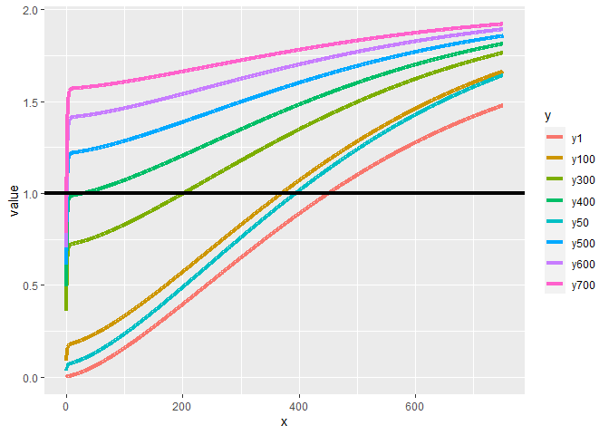
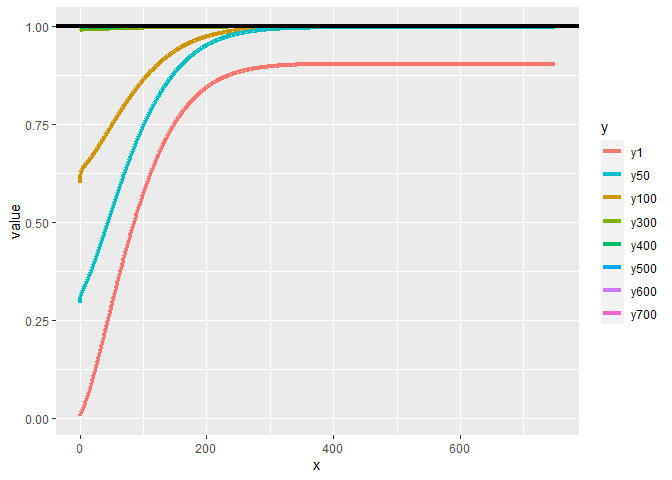

Review of *The Interaction of Wildfire Risk Mitigation Policies in the
Presence of Spatial Externalities and Heterogeneous Landowners*, Al
Abri, Goran, 2019
================
2022-07-27

# Contribution

This paper investigates the game interaction surrounding wildfire
prevention in a landscape with different owners. In a dynamic model of
vegetation growth, landowners choose how much forest to cut down to
prevent wildfires. Considering that wildfire ignition risk, spread and
damage are dependent on the fuel stock, the authors investigate the
implications of different beliefs and information sets. In this setting,
landowners may operate based on misconceptions of the probabilities of
wildfires or their damages. The authors investigate how these beliefs
may lead to socially inefficient outcomes.

## My comments, feelings, questions

I’m kind of disappointed by the absence of spatial process, and the
consideration of just a forest stock.

I’m still kind of confused about the formulation of the fire ignition
process. Indeed, whether fire ignites in

or in

and spreads, or in

and in

and spreads, the results are the same. There is no intensity element.

# Technical issues

While the paper raises an interesting question, it is flawed in several
respects, when it comes to its core formulation.

## Binary variable for fire occurrence, probability and arrival rate

First, a random variable

measures the occurrence of fire. The arrival of fire is said to be
modeled as a Poisson distribution. However, the random variable depicted
here is binary, while Poisson processes describe a number of occurrences
over a finite period. It is therefore left to the reader how to make
sense of this formulation. Indeed, the question remains as to how

maps to the Poisson process.

My interpretation is that that is to say, fire occurs if the fire
arrival variable that follows a Poisson distribution has a realization
which value is superior to 0. Hence : Therefore:

## Concerns about the arrival rate : formulation, temporal mismatch, reliance on the forest biomass

In eq(13) of the article, the “arrival rate” is defined as :

=1-e^{-\gamma\frac{k(f_{jt})+k(f_{kt})}{W}}
")

If anything, the relevant formulation here would be : Which is
consistent with the interpretation of an arrival rate depending on the
fuel, as it grows with the fuel.

Moreover, there seems to be a temporal mismatch. In section 2.4, the
authors write:

*in the absence of fuel treatment of fire, forest biomass growth is
given by
")*

Therefore, the biomass is governed by this growth function. It is
striking that , the fire arrival rate and hence, the probability that
the parcel ignites depends on
")

On a more conceptual note, it is unclear why the ignition rate on any
parcel depends on the total forest area. Ignition probabilities are
mostly local, depending on environmental conditions, and not necessarily
based on the amount of available fuel. Considering small neighboring
parcels, it is likely that those environmental conditions are identical.

## A surprising damage function

The formulation of the damage function is difficult to rationalize. In
equation (4), the authors posit that the damage resulting from the fire
is a *decreasing* function of the standing forest. There is no comment
on this hypothesis. Later on, in table 1, which displays the
specifications of the functional forms : Two comments are in order:

1.  The derivative of the damage function is clearly positive, hence
    contradicting equation (4):

2.  The limits are such that :

## The formulation of the expected damage

### A reformulation of the paper’s formula

Third, the formulation in equation (5) of the expected damage includes:

-   *the probability of fire occurring on parcel j and the associated
    damage and*
-   *the probability of fireoccurring on parcel k and spreading to
    parcel j and the associated damage*

However, the formulation of equation (5) is : In this equation, except
for
,
there is no probability. It is merely a formulation of the damage in a
potential outcome framework, without the associated probability.

A relevant expected damage function would write, in this context :

### Independence and expected damage as a share

From line 1 to line 2, the independence of ignition and spread is
required to obtain a formulation akin to that of the authors. However,
the local probability of ignition and the probability of spread both
depends on the forest stock. Therefore, *one cannot assume that the two
variables are independent*.

For the sake of the argument, assuming that both ignition and spread are
independent, this would imply :

(1-e^{-\lambda})(1+\phi(f_{kt}))
")

The following graph traces the expected damage for different values of
the forest standing in the neighboring lot. It is clear that the
formulation of the damage function as a share requires additional
assumptions and that the false assumption of independence lead to
results that contradict the share formulation:

<!-- -->

This result is not surprising. A decomposition of the the article’s
formulation of expected damage function can help explain those results :

-   The damage, depending on the forest stock in parcel
    .
    The functional form of the damage function guarantees that
    ![\\forall f\_{jt}, D(f\_{jt}) \\in \[0,1\]](https://latex.codecogs.com/png.image?%5Cdpi%7B110%7D&space;%5Cbg_white&space;%5Cforall%20f_%7Bjt%7D%2C%20D%28f_%7Bjt%7D%29%20%5Cin%20%5B0%2C1%5D "\forall f_{jt}, D(f_{jt}) \in [0,1]"),
    and that it increases with
    

-   The probabilities of the damage occurring :

    -   The probability of ignition in site
        
        and
        ,
        increasing in
        
        and
        ,
        and

    -   The probability of spread which increases with
        
        and

The problem therefore lies in an incorrect formulation of the in parcel
.
In this setting, the probability that parcel

does not ignite is not taken into account when considering the spread
from cell
.
Therefore, as both ignition and spread probabilities increase in the
stock, this formulation implies the limit probability of fire occurrence
in cell

to converge to 2 instead of 1. In the current formulation, the set of
events that lead to fire occurrence in parcel

are

-   Fire ignition in parcel
    ,
    irrespective of the other set of events (ignition and spread in
    parcel
    )
-   No ignition in parcel
    
    
    ignition in parcel
    
    
    spread from
    
    to
    

Taking the expectation with respect to the correct formulation of the
set of events :

Once again, using the hypothesis of the independence of ignition and
spread for cell

:

Using this formulation, the expected damage is now capped at 1 :

<!-- -->

